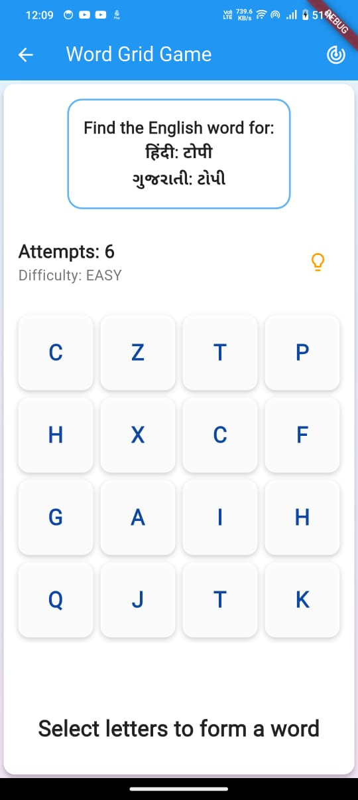

# Language Learning App 🌍

[](https://flutter.dev/)
[](LICENSE)
[](CONTRIBUTING.md)

A modern language learning application built with Flutter that helps users learn multiple languages through interactive quizzes, flashcards, and practice exercises.


## ✨ Features

- 🎯 Interactive vocabulary quizzes with difficulty levels
- 🔤 Support for multiple languages (Hindi, Gujarati)
- 🎮 Word Grid Game for engaging practice
- 💡 Smart quiz generation using WordsAPI
- 🌙 Dark/Light theme support
- 📱 Responsive design for all devices

## 📱 Screenshots

<p float="left">
  
   
  
  
</p>

## 🚀 Getting Started

### Prerequisites

- Flutter (3.0 or higher)
- Dart SDK
- Android Studio / VS Code
- Git

### Installation

1. Clone the repository
```bash
git clone https://github.com/tirthgodhani/language_learning.git
```

2. Navigate to project directory
```bash
cd language_learning
```

3. Install dependencies
```bash
flutter pub get
```

4. Run the app
```bash
flutter run
```

## 🛠️ Built With

- [Flutter](https://flutter.dev/) - UI Framework
- [WordsAPI](https://wordsapi.com/) - Word Definitions API
- [Firebase](https://firebase.google.com/) - Backend & Authentication
- [Provider](https://pub.dev/packages/provider) - State Management

## 🎯 Core Features

- **Quiz System**: Multiple difficulty levels with adaptive scoring
- **Word Grid Game**: Interactive word search with multilingual support
- **Progress Tracking**: Track learning progress across languages
- **Offline Support**: Basic functionality works without internet
- **Cloud Sync**: Sync progress across devices

## 🤝 Contributing

Contributions are welcome! Please feel free to submit a Pull Request.

1. Fork the project
2. Create your feature branch (`git checkout -b feature/AmazingFeature`)
3. Commit your changes (`git commit -m 'Add some AmazingFeature'`)
4. Push to the branch (`git push origin feature/AmazingFeature`)
5. Open a Pull Request

## 📄 License

This project is licensed under the MIT License - see the [LICENSE](LICENSE) file for details

## 👨‍💻 Author

- Tirth Godhani - https://github.com/tirthgodhani

## 🙏 Acknowledgments

- All contributors and supporters
